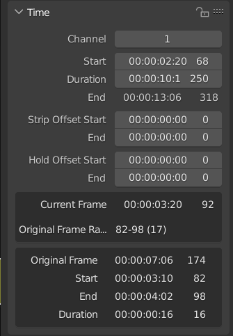

= Show VSE scene strip's internal current frame

Very light wrapping around https://github.com/admorris86[Adam Morris'] https://github.com/admorris86/Blender-Scripts/blob/main/VSE_show_strip_real_frame_number.py[implementation] with https://github.com/tin2tin[tin2tin's] poll function included.

